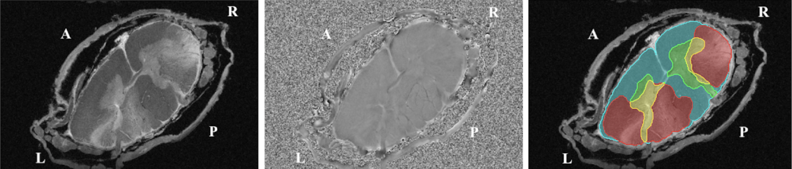
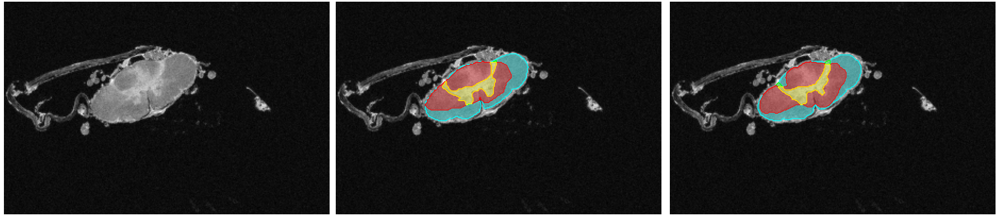

# model_seg_sc-gm-lesion_human_ms_exvivo_t2star

Segmentation of spinal cord **white matter**, **gray matter**, and **MS lesions** from high-resolution
**ex vivo** GRE magnitude + phase MRI (nnU-Net based).

Two models are trained: a **3D model** (use this one — best results, what the paper reports) and a
**2D model** (used internally to bootstrap the 3D model's training labels; kept for the paper's ablations,
not meant for general use).




### Results (3D model, cross-validation, mean ± std over subjects)

| WM Dice | GM Dice | Lesion (WM) Dice | Lesion (GM) Dice |
|---|---|---|---|
| 0.901 ± 0.053 | 0.866 ± 0.050 | 0.545 ± 0.319 | 0.443 ± 0.282 |

Full results, ablations, and methods: [arxiv.org/abs/2605.12753](https://arxiv.org/abs/2605.12753).

## Setup

```bash
git clone git@github.com:ivadomed/model_seg_sc-gm-lesion_human_ms_exvivo_t2star.git
cd model_seg_sc-gm-lesion_human_ms_exvivo_t2star
python -m venv ../.venv && source ../.venv/bin/activate && pip install -r requirements.txt
bash install_trainers.sh   # registers the custom nnU-Net trainers in the venv
```

Data and run outputs live next to the repo, not inside it (`../ms-exvivo-nih`, `../nnUNet_data`,
`../outputs`), auto-detected by `paths.sh`. Override with `PROJECT_ROOT=/path/to/parent ...`.

### Get the data (lab members only, for now)

```bash
git clone git@data.neuro.polymtl.ca:datasets/ms-exvivo-nih ../ms-exvivo-nih
cd ../ms-exvivo-nih && git annex get . && cd -
```
~41 GB, git-annex. Ask for access to the lab's data server first.

## Run inference with the released model

```bash
curl -LO https://github.com/ivadomed/model_seg_sc-gm-lesion_human_ms_exvivo_t2star/releases/download/r20261002/Dataset011_3D_MagPhase_adamw_baseline.zip
unzip Dataset011_3D_MagPhase_adamw_baseline.zip
bash inference_publication/run_infer_3d_public.sh <input_dir> <output_dir> \
  Dataset011_3D_MagPhase_adamw_baseline/nnUnet3DCustomTrainer__nnUNetPlans_p192x64x208__3d_fullres
```

`<input_dir>` is an nnU-Net `imagesTs`-style folder: `CASE_0000.nii.gz` (magnitude) [+ `CASE_0001.nii.gz` (phase)].
Add `--tta` for test-time augmentation; override GPU/checkpoint with `GPU_ID=1 CHECKPOINT=checkpoint_final.pth`.

## Reproduce the paper's experiments

Every experiment is one JSON file under `2D_workspace/experiments/` or `3D_workspace/experiments/`
(dataset + trainer config). `reproduce/` holds the scripts that run them — each builds/preprocesses
its dataset on first use and injects the paper's 4-fold subject split (`splits/`):

```bash
bash reproduce/run_experiment_training_3D.sh adamw_baseline 0        # train one fold
bash reproduce/run_experiment_inference_3D.sh adamw_baseline <input_dir> --gt <gt_dir>   # predict + score
```

Same pattern for 2D (`run_experiment_training_2D.sh` / `run_experiment_inference_2D.sh`). Metrics are
written as `metrics_casewise.csv` / `metrics_summary.csv` by `helpers/eval.py`, shared by both pipelines.
`reproduce/run_subject_stats_campaign_{2D,3D}.sh` reproduces the paper's per-subject statistical tables.

To add an experiment, copy the closest JSON and edit `trainer_config` / `dataset`.

Sanity-check the whole pipeline end to end (2-epoch smoke run): `bash tests/run_smoke.sh`.

## Repository layout

```
paths.sh, install_trainers.sh      setup
reproduce/                          scripts that (re)train, (re)predict, and re-score the paper's experiments
inference_publication/              standalone inference with the released model
2D_workspace/, 3D_workspace/        dataset building + nnU-Net trainers, each with its own experiments/
helpers/                            shared code: metrics, config loading, splits, stats
splits/                             the paper's 4-fold subject splits
tests/                              smoke test
doc/                                figures
```

## Citation

```bibtex
@misc{hoareau2026optimization,
  title={Optimization in Sparse 2D to Dense 3D Weakly Supervised Learning: Application to Multi-Label Segmentation of Large ex vivo MRI Data},
  author={Hoareau, Paul and Wang, Kuan Yi and Bujak, Brandon and Sun, Roy and Nair, Govind and Cortese, Irene and Tsagkas, Charidimos and Reich, Daniel S. and Cohen-Adad, Julien},
  year={2026},
  eprint={2605.12753},
  archivePrefix={arXiv},
  url={https://arxiv.org/abs/2605.12753}
}
```
