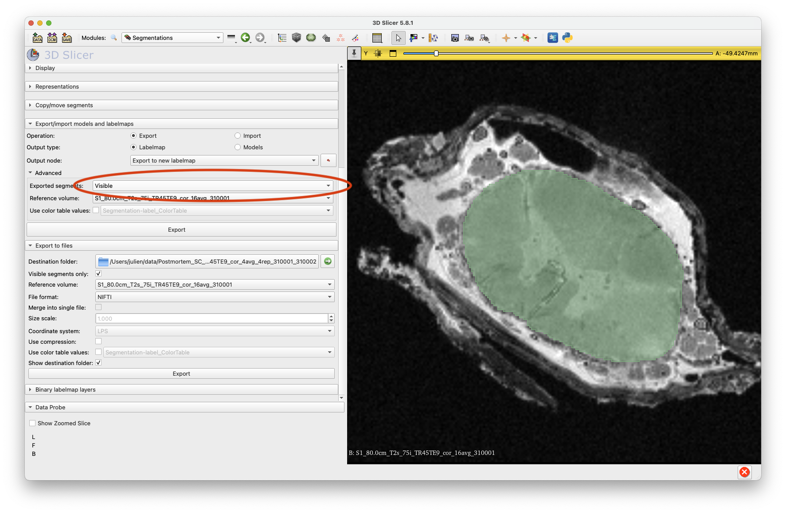

# Detailed procedure for training the model with nnUnet

Here, we detail all the steps necessary to train and use an nnUNet model for the segmentation of mouse SC WM an GM. 
The steps detail how to :
- [Setup environment](#setup-environment)
- [Prepare data](#prepare-data)
- train the model
- performing inference

## Setup environment

This section explains how to install and use the model on new images. 

Clone the repository:
~~~
git clone https://github.com/ivadomed/model_seg_sc-gm-lesion_human_ms_exvivo_t2star.git
cd model_seg_sc-gm-lesion_human_ms_exvivo_t2star
~~~

Create and activate virtual environment (tested with Python 3.13.2): 
~~~
python3 -m venv venv
source ./venv/bin/activate
~~~

Install the required libraries:
~~~
pip install --upgrade pip
pip install -r requirements.txt
~~~

## Prepare data

Download dataset (internal git-annex at NeuroPoly): `TODO`

The dataset is organized according to BIDS:

```
DATASET
├── derivatives
│   └── labels
│       └── sub-01
│           └── anat
│               ├── sub-01_part-mag_chunk-02_T2starw_label-GM_seg.nii.gz
│               ├── sub-01_part-mag_chunk-02_T2starw_label-lesion_seg.nii.gz
│               └── sub-01_part-mag_chunk-02_T2starw_label-SC_seg.nii.gz
└── sub-01
    └── anat
        ├── sub-01_part-mag_chunk-02_T2starw.nii.gz
        └── sub-01_part-phase_chunk-02_T2starw.nii.gz
```

Let's define some SHELL variables for convenience:

~~~
PATH_DATA="<PATH_TO_DATASET>"
~~~

### Manual annotation

Segment a few slices per volume, see example below:




### Convert labels to one-hot encoder

Because of the need to create single file with one-hot encoder for nnUnetv2 (more details here #2), we need a script to combine manually segmented SC, GM and lesion into several non-overlapping classes. Example for white matter and gray matter:

```json
{
  "background": 0,
  "SC_without_GM": 1,
  "SC_GM": 2
}
```

~~~
python combine_labels.py --path-label-in ${PATH_DATA}/derivatives/labels --path-label-out ${PATH_DATA}/derivatives/labels_combined-sc-gm --suffixes SC GM --priors GM:SC
~~~

Now would be a good time to introduce another environment variable:
~~~
PATH_PROCESSED="<PATH_TO_PROCESSED_DATASET>"
~~~

### Extract slices

Extract 2D slices from each of the 3D volume, where labels are present, and generate a new folder that will be used for training the nnUNet model:

~~~
python extract_slices.py --path-data ${PATH_DATA} --label-folder derivatives/labels_combined-sc-gm --labels combined --path-out ${PATH_PROCESSED}/data_slice
~~~

### Convert from BIDS to nnU-Net file structure

To be able to use nnU-Net trainer, we need to convert the file structure, notably:
- Rename and organize files according to train/test sets
- Create the descriptor `data.json`
- Convert files to 3D NIfTI objects (even though these are single slice), to address #6.

~~~
python convert_bids_to_nnunet.py --path-data ${PATH_PROCESSED}/data_slice --label-json ${PATH_DATA}/derivatives/labels_combined-sc-gm/sub-01/anat/sub-01_part-mag_chunk-02_T2starw_label-combined_classes.json --tasknumber 502
~~~

This will output a dataset called `Dataset502_Segmentation` in the `${PATH_PROCESSED}/nnunet_raw` folder.

### nnUNet data preprocessing

Before training the model, nnUNet performs data preprocessing and checks the integrity of the dataset:

~~~
export nnUNet_raw="${PATH_PROCESSED}/nnunet_raw"
export nnUNet_preprocessed="${PATH_PROCESSED}/nnunet_preprocessed"
export nnUNet_results="${PATH_PROCESSED}/nnunet_results"

nnUNetv2_plan_and_preprocess -d 502 --verify_dataset_integrity
~~~

You will get the configuration plan for all four configurations (2d, 3d_fullres, 3d_lowres, 3d_cascade_fullres).

> [!NOTE] 
> In the case of this dataset, nifti files are not fully annotated, therefore we use a 2d configuration.

## Optional: Copy nnUNet custom trainer for WanDB monitoring

~~~
cp nnUNetTrainerWandb.py ../venv/lib/python3.13/site-packages/nnunetv2/training/nnUNetTrainer/variants/
~~~

And add the flag `-tr nnUNetTrainerWandb` to the `nnUNetv2_train` command (see next section).

## Train model

To train the model, use the following command:

~~~
CUDA_VISIBLE_DEVICES=<GPU_ID> nnUNetv2_train <DATASET_ID> <FOLD> <CONFIG_FOLD> --npz -device <DEVICE>
~~~

Example:
~~~
nnUNetv2_train 502 2d 0 --npz -device mps -tr nnUNetTrainerWandb
~~~

Track training progress:
~~~
nnUNet_results/DatasetDATASET-ID_TASK-NAME/nnUNetTrainer__nnUNetPlans__CONFIG/fold_FOLD/progress.png
~~~


## Running inference

To run inference using our trained model, we recommend using the instructions in [README.md](../README.md). However, if you want to perform inference on your own model, there are multiple ways to do so. 

### Method 1 - Using your previous training

Format the image data to the nnU-Net file structure. 
Use a terminal command line:
~~~
export nnUNet_raw="/path/to/nnUNet_raw"
export nnUNet_preprocessed="/path/to/nnUNet_preprocessed"
export nnUNet_results="/path/to/nnUNet_results"

CUDA_VISIBLE_DEVICES=XXX nnUNetv2_predict -i /path/to/image/folder -o /path/to/predictions -d DATASET_ID -c CONFIG --save_probabilities -chk checkpoint_best.pth -f FOLD
~~~

You can now access the predictions in the folder `/path/to/predictions`. 

### Method 2 - Using our trained model on terminal 

Format the image data to the nnU-Net file structure. 
Download the `model.zip` from the [release](https://github.com/ivadomed/model_seg_mouse-sc_wm-gm_t1/releases/tag/v0.3) and unzip it in the `/nnUNet_results` folder (it also requires to export the 3 variables as done previously). 
Then run the terminal command linde:
~~~
CUDA_VISIBLE_DEVICES=XXX nnUNetv2_predict -i /path/to/image/folder -o /path/to/predictions -d 500 -c 3d_fullres --save_probabilities -chk checkpoint_best.pth -f 4
~~~

You can now access the predictions in the folder `/path/to/predictions`. 

## Apply post-processing

nnU-Net v2 comes with the possiblity of performing post-processing on the segmentation images. This was not included in the run inference script as it doesn't bring notable change to the result. To run post-processing run the following script.

~~~
CUDA_VISIBLE_DEVICES=XX nnUNetv2_apply_postprocessing -i /seg/folder -o /output/folder -pp_pkl_file /path/to/postprocessing.pkl -np 8 -plans_json /path/to/post-processing/plans.json
~~~
> [!NOTE]  
> The file `postprocessing.pkl` is stored in `Dataset500_zurich_mouse/nnUNetTrainer__nnUNetPlans__3d_fullres/crossval_results_folds_0_1_2_3_4/postprocessing.pkl`.<br>
> The file `plans.json` is stored in `Dataset500_zurich_mouse/nnUNetTrainer__nnUNetPlans__3d_fullres/crossval_results_folds_0_1_2_3_4/plans.json`. 
